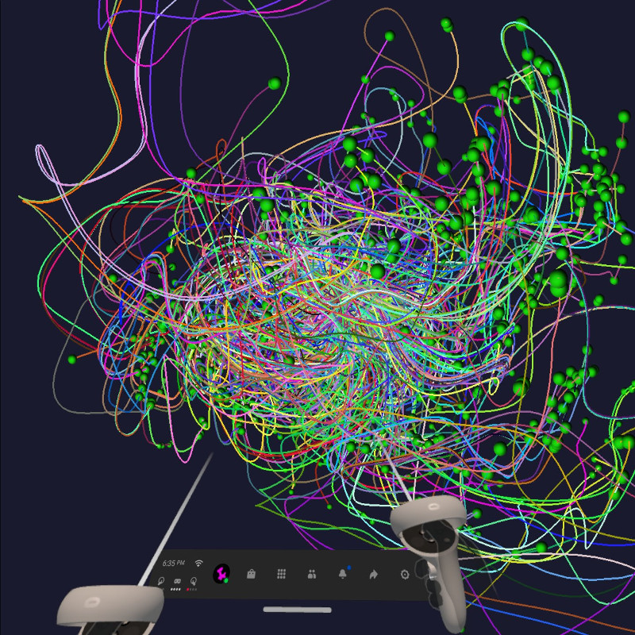

# vr-flu-galaxy

An interactive 3D visualization of the evolutionary paths.



Start: https://viewzavr.com/apps/vr-flu-galaxy

# input file format

Json-formatted file of trajectories in form:
```
 [
   [x,y,z,x,y,z,x,y,z,.....],
   [x,y,z,x,y,z,x,y,z,.....],   
   ....
   [x,y,z,x,y,z,x,y,z,.....],   
 ]   
```

# copyright

2021 (c) Majid Forghani, Pavel Vasev

* Visualization idea and computations by Majid Forghani. 
* Graphics by Pavel Vasev, Computer visualization lab, https://cv.imm.uran.ru

N.N. Krasovskii Institute of mathematics and mechanics
of Russian Academy of Sciences
Ekaterinburg, Russia

